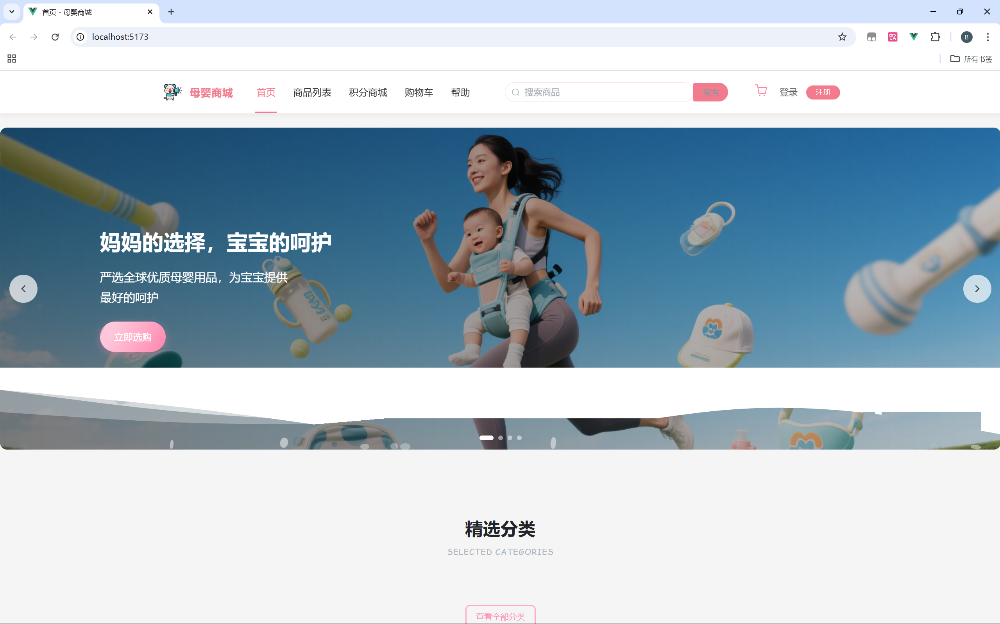
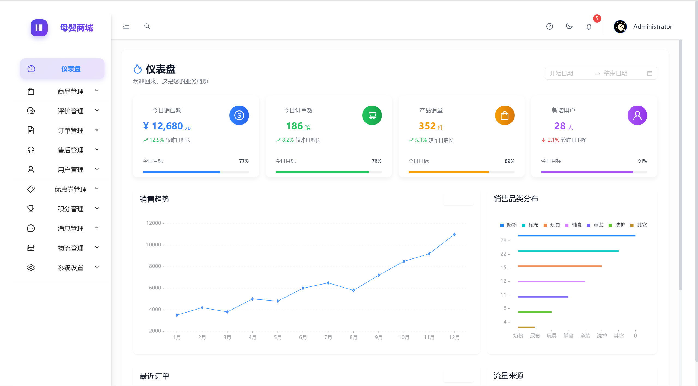
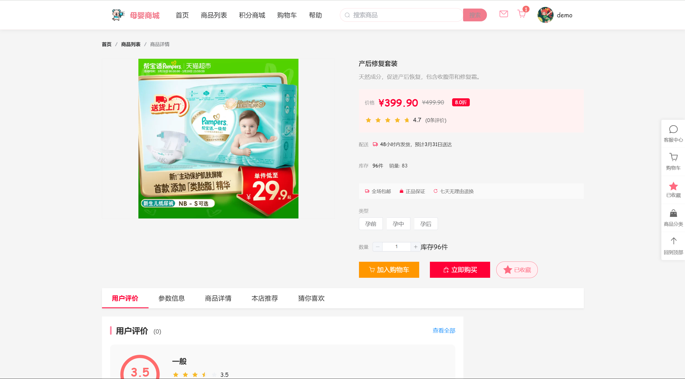
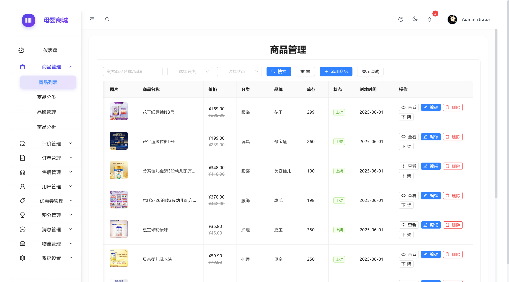

# 母婴商城系统 (Muying Mall System)

<p align="center">
  
  
  
  
  
</p>

<p align="center">现代化全栈母婴电商平台，包含前台商城、后台管理系统和后端API服务</p>

## 项目介绍

母婴商城系统是一个完整的母婴电商解决方案，包含三个主要组成部分：

1. **前台商城系统**（[muying-web](https://github.com/your-username/muying-web)）- 基于Vue 3开发的用户端购物系统
2. **后台管理系统**（[muying-admin-react](https://github.com/your-username/muying-admin-react)）- 基于React开发的管理员操作界面
3. **后端API服务**（[muying-mall](https://github.com/your-username/muying-mall)）- 基于Spring Boot开发的后端服务

本仓库提供了项目的整体文档和部署指南，帮助开发者理解系统架构并快速启动项目。

## 系统架构

母婴商城系统采用前后端分离架构：

```
┌─────────────┐      ┌─────────────┐      ┌─────────────┐      ┌─────────────┐
│   用户浏览器  │ <──> │  前台商城系统 │      │  后台管理系统 │ <──> │ 管理员浏览器 │
└─────────────┘      └──────┬──────┘      └──────┬──────┘      └─────────────┘
                           │                     │
                           ▼                     ▼
                     ┌─────────────────────────────────┐
                     │        API 网关 / 后端服务        │
                     └─────────────┬─────────────────┬─┘
                                   │                 │
                    ┌──────────────▼──┐    ┌─────────▼────────┐
                    │    MySQL 数据库  │    │ Redis/ElasticSearch│
                    └─────────────────┘    └──────────────────┘
```

详细的架构设计文档请参见 [架构设计文档](./docs/architecture/README.md)

## 功能特性

### 前台商城系统
- 用户注册与登录
- 商品浏览与搜索
- 购物车与结算
- 订单管理
- 用户中心
- 支付集成
- 移动端适配

### 后台管理系统
- 数据分析仪表盘
- 商品管理
- 订单管理
- 用户管理
- 内容管理
- 系统设置
- 权限控制

### 后端API服务
- RESTful API
- JWT认证
- 分布式缓存
- 数据库事务
- 全文搜索
- 支付接口集成

## 快速开始

请参考以下文档来设置和运行母婴商城系统：

- [前台商城系统开发指南](./docs/development/frontend-web.md)
- [后台管理系统开发指南](./docs/development/frontend-admin.md)
- [后端API服务开发指南](./docs/development/backend.md)
- [完整部署指南](./docs/deployment/README.md)

## 项目演示

### 演示视频

<div align="center">
  <table>
    <tr>
      <td align="center" width="50%">
        <strong>前台商城演示</strong><br/>
        <a href="https://live.csdn.net/v/480130" target="_blank">
          <br/>
          <span>点击观看演示视频 →</span>
        </a>
      </td>
      <td align="center" width="50%">
        <strong>后台管理系统演示</strong><br/>
        <a href="https://live.csdn.net/v/480131" target="_blank">
          <br/>
          <span>点击观看演示视频 →</span>
        </a>
      </td>
    </tr>
  </table>
</div>

> 查看[详细功能演示文档](./docs/demo.md)获取更多系统功能的详细介绍和演示说明。

### 界面预览
<div align="center">
  
  
</div>

<div align="center">
  
  
</div>

## 文档导航

- [API文档](./docs/api/README.md)
- [架构设计](./docs/architecture/README.md)
- [数据库设计](./docs/database/README.md)
- [开发指南](./docs/development/README.md)
- [部署指南](./docs/deployment/README.md)
- [业务流程](./docs/business/README.md)
- [功能演示](./docs/demo.md)

## 技术栈

### 前端
- Vue 3.5 / React 19
- Vite / Redux Toolkit
- Element Plus / Ant Design
- TailwindCSS
- Pinia / Redux

### 后端
- Spring Boot 3.2
- MyBatis-Plus
- Redis
- JWT
- Elasticsearch
- MySQL 8

## 贡献指南

欢迎贡献代码或提出建议！请查看 [贡献指南](./CONTRIBUTING.md) 了解如何参与项目。

## 许可证

本项目采用 MIT 许可证 - 详见 [LICENSE](./LICENSE) 文件 